# Arduino-Ventilator
# Final Project - Arduino-Based Mechanical Ventilator

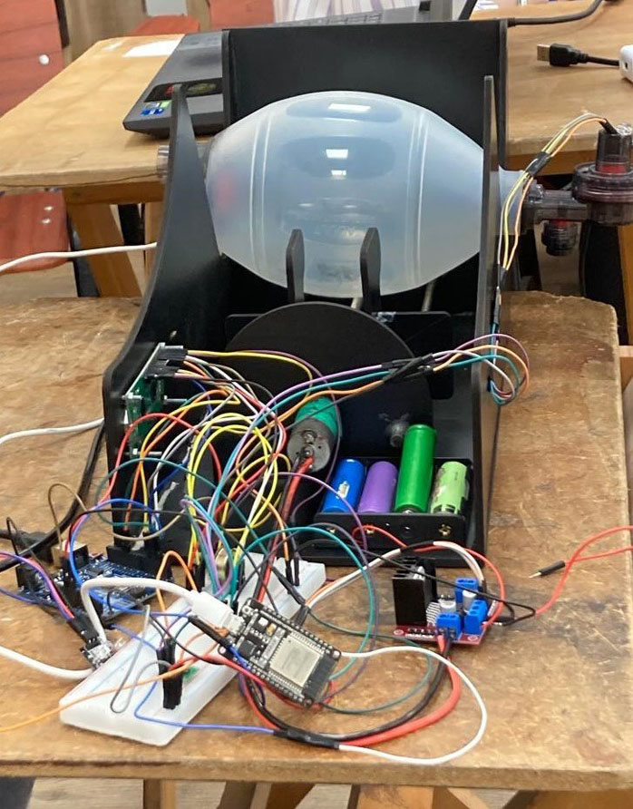

In this project, we decided to build an Arduino-based mechanical ventilator. We used the ESP32 microcontroller alongside other sensors, actuators, and other components listed below to simulate Volume-Control Ventilation. We built a Flutter application to get patient data, and required Breaths Per Minute, and display sensor readings for monitoring purposes. We connected the microcontroller with the Flutter app through Firebase, and used Firebase Real-time Database to store the project's data.

## Used Components
- ESP32 DevKit V1
- Arduino Uno (Optional)
- Ambu Bag
- BMP280 Pressure Sensor
- AHT21B Temperature and Humidity Sensor
- KY039 Heartrate Sensor
- DC Motor 12V/300RPM
- L298N Motor Driver
- 4 x 3.7V Li-ion Battery
- 4-Cell Battery Holder
- LCD 16x2 Display
- 10k Potentiometer

 

## Project Details
Our project is divided into two main parts, the hardware components and the flutter app.  
For the hardware, we have three sensors for monitoring purposes. The heartrate and temperature sensors could be placed anywhere. The pressure sensor is placed at the end of the ambu bag to monitor air pressure. The sensors' readings are sent to the Firebase RTDB, and displayed on the LCD at the side of the wooden ventilator frame. The DC motor has a metal rod with a wooden handle attached to it. When the DC motor moves forward, it spins the metal rod, moving the handle forward to squeeze the ambu bag, and the opposite happens with the DC motor moving backwards. When the RTDB receives a new Breath Rate (breath per minute) value, the DC motor starts moving. 
For the flutter app, first, the user has to log in or sign up. Next, they enter their information such as age, weight, etc.. and specify the breath rate used to operate the ventilator. These values are all saved in the RTDB. Then, there's a screen that displays all sensor readings. The user can also see their previeously entered information. The app also has two more features: First, it can measure heart rate using phone camera. Second, it can calculate BMI and display results in a separate screen.

### Flutter App

    
    
    
    
    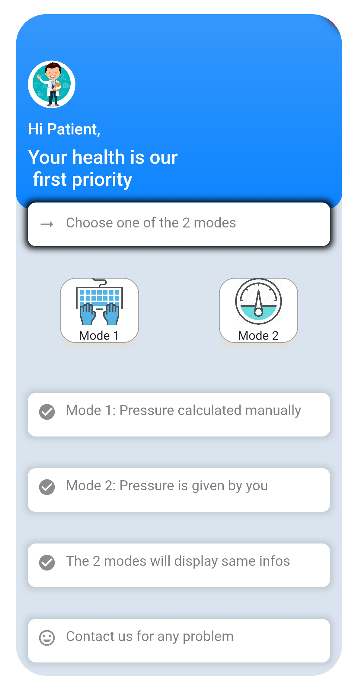
    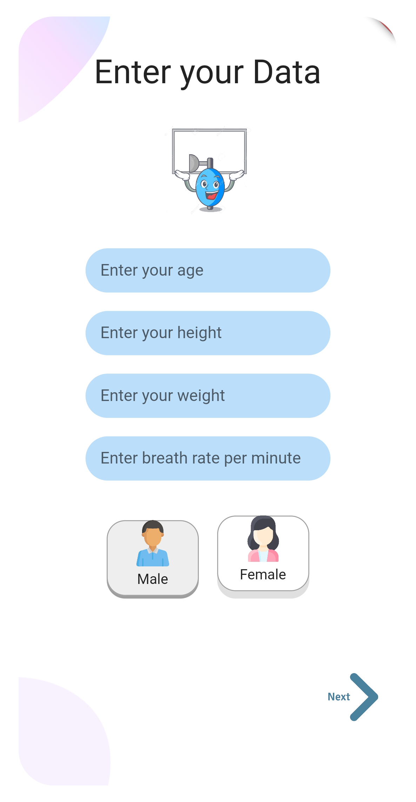
    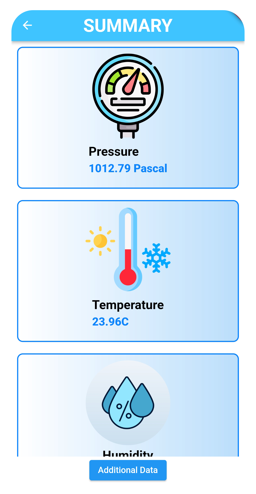
    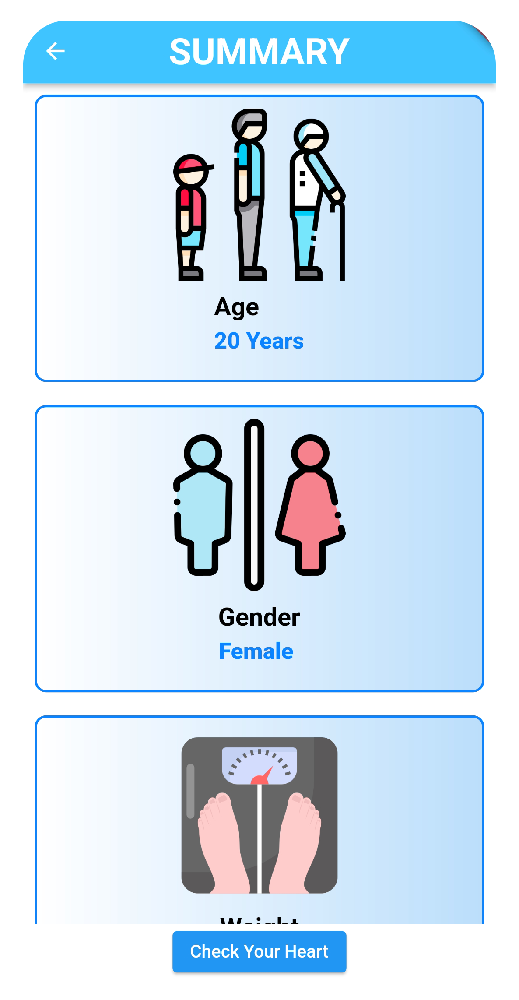
    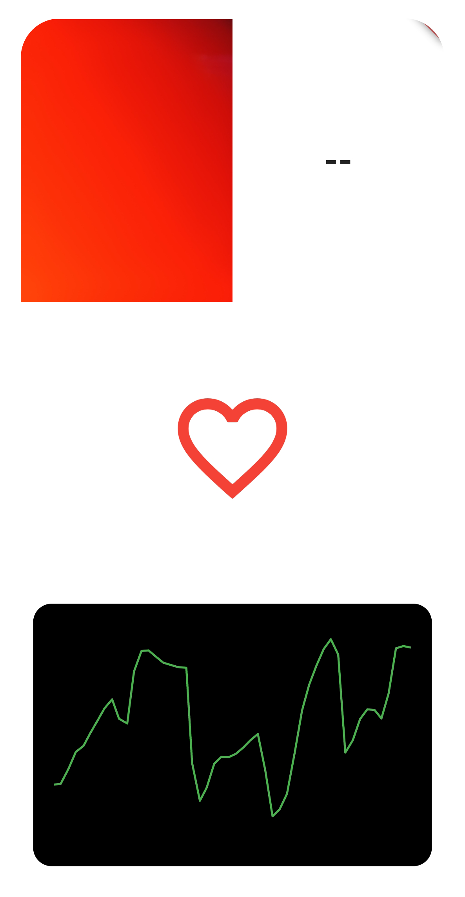
    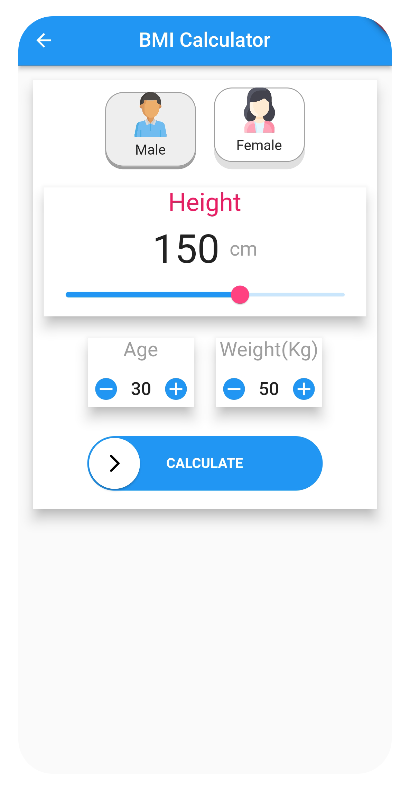
    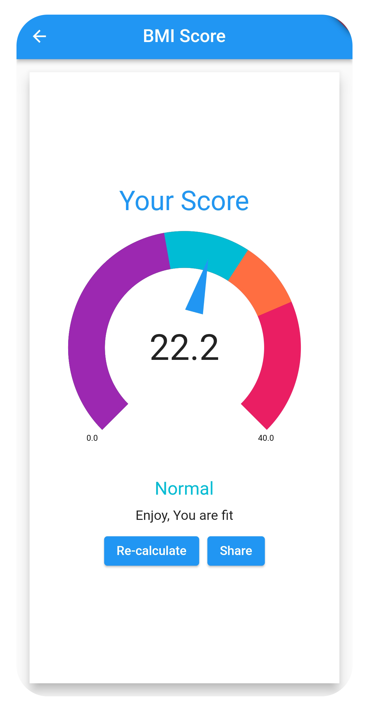

### Hardware Connections

    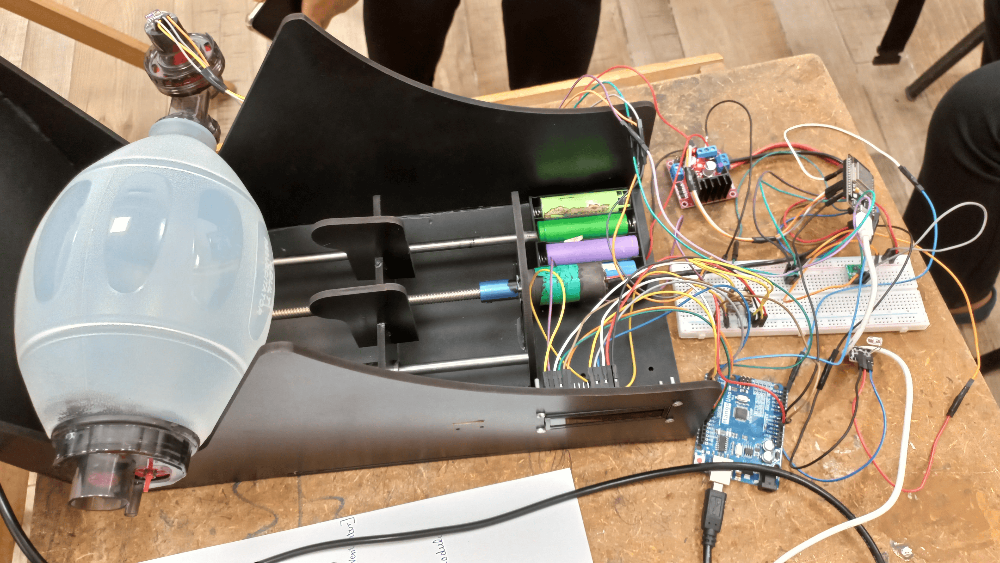

 
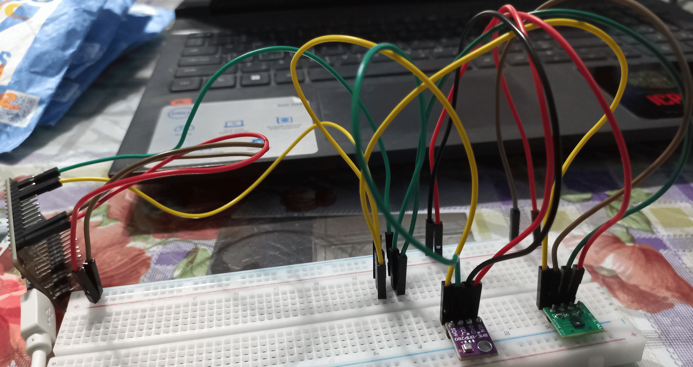
  
Pressure and Temperature sensors are both I2C sensors, so they are connected to 3.3V, GND, SDA, and SCL pins. The ESP32 has only one SDA and one SCL pin, so we connected each to a node/row, and connected the sensors' SDA and SCL pins to the same node, like this (green is SCL, yellow is SDA):
 

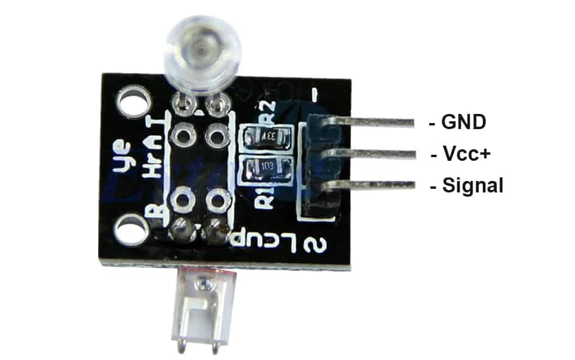
  
&nbsp;&nbsp;&nbsp;The heartrate sensor is connected as follows, with the signal connected to pin 34: 
&nbsp;&nbsp;&nbsp;[Image by <a href="https://www.thegeekpub.com/wiki/sensor-wiki-ky-039-heartbeat-sensor/">thegeekpub</a>]
 

  
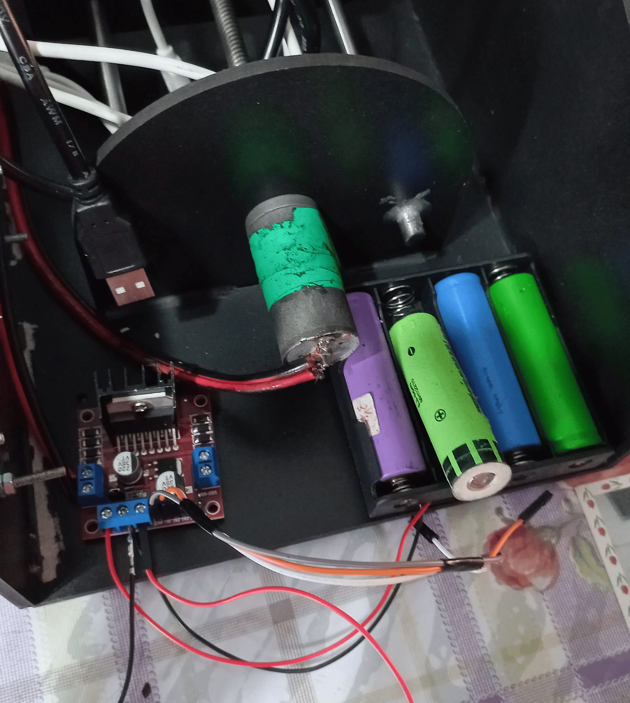
The L298N motor driver is used to control the DC motor. As the DC motor needs a 12V power source, we used 4 3.7V batteries to give a 14.8V output. The motor driver is connected similarly to the image below. We used pins 14, 27, and 26 for the driver's EN1, IN1, and IN2 respectively.  
[Image by <a href="https://www.instructables.com/How-to-Use-L298n-to-Control-Dc-Motor-With-Arduino/">instructables</a>]  
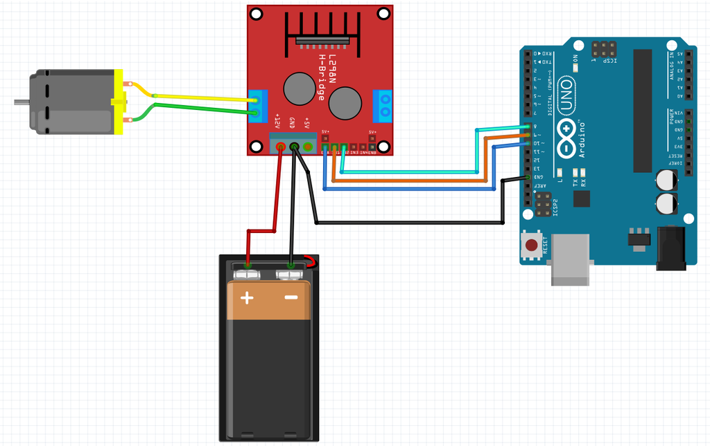
 

  
To avoid electrical interference, we connected the LCD to the Arduino Uno, and established serial communication between the ESP32 and the Arduino Uno to send data to be displayed on the LCD. The LCD used digital pins 12, 11, 5, 4, 3, 2 in order. To establish serial communication, we must connect each device's TX pin to the other's RX pin, and must have a common ground connection.

    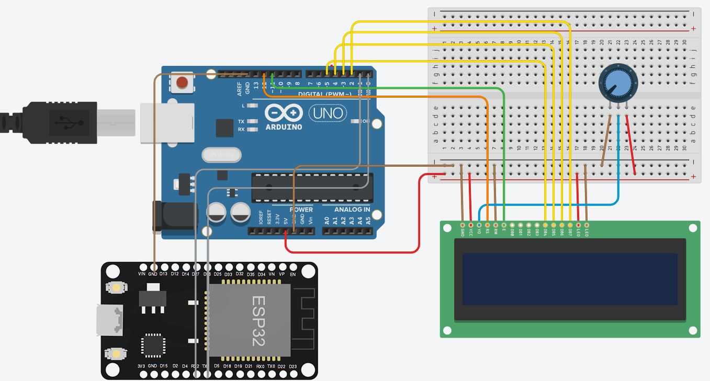

 

## Contributers - Team 10
[Verina Michel](https://github.com/verinak) 
[Ola Mamdouh](https://github.com/olamahdi) 
[Marly Magdy](https://github.com/marlymagdy) 
[Maria Anwar](https://github.com/Maria1516) 
[Mariem Nasr](https://github.com/MariemNasr) 
[Mirna Tarek](https://github.com/Mirna-tarek) 
